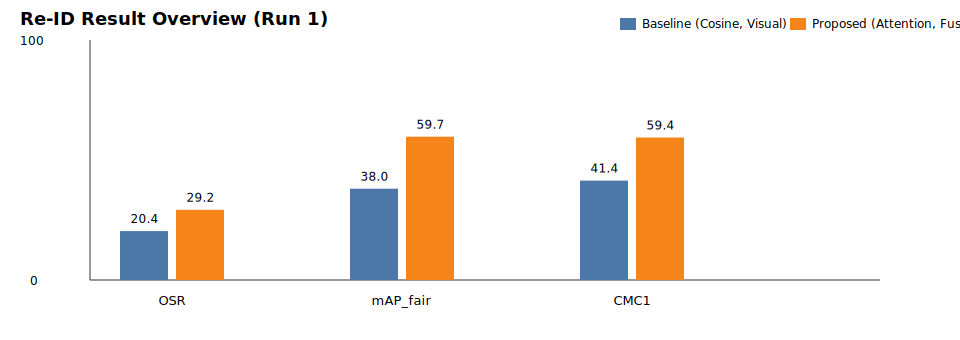
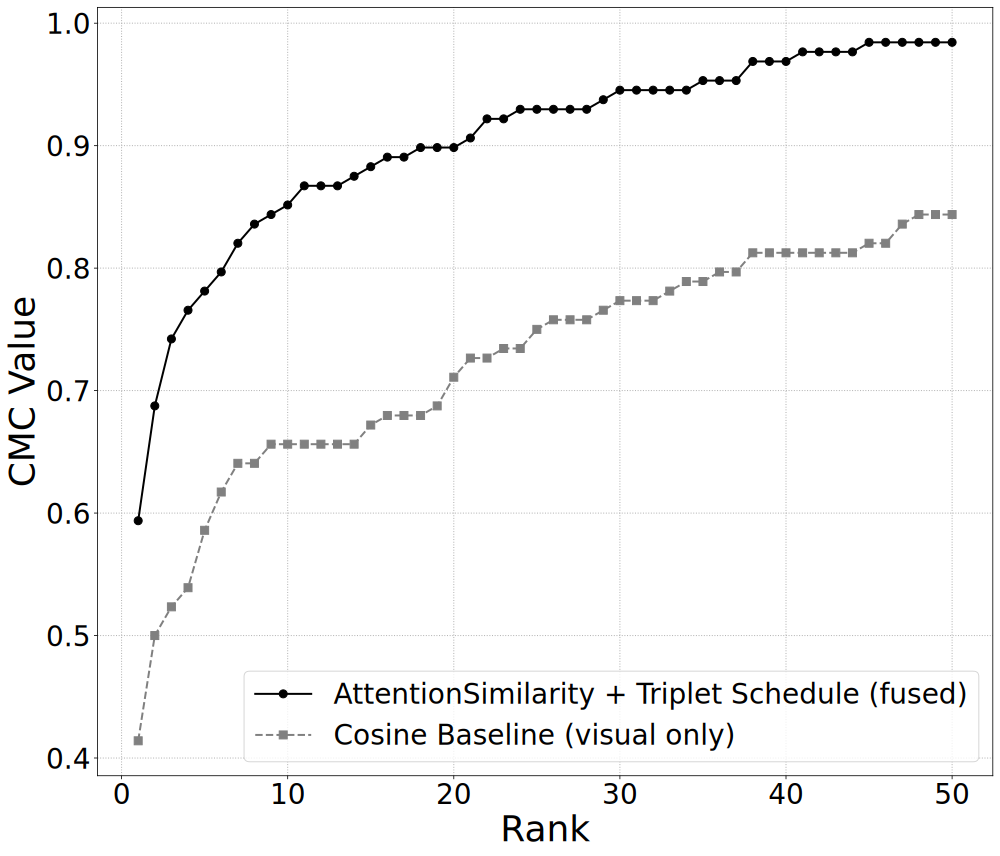
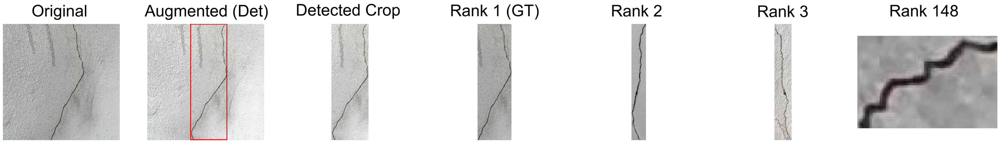

# Crack Re-ID

Production-style ML pipeline for UAV crack detection and crack re-identification.

Core model stack:
- Detection/segmentation: YOLO
- Visual embedding: DINOv2
- Geometry embedding: segmentation-mask-based shape descriptors
- Matching: attention-based similarity learning

## Thesis Results Snapshot

The following visuals are generated from the experiment outputs used in my thesis defense.

### Re-ID Performance (Baseline vs Proposed)



- **Baseline**: cosine similarity on visual features only
- **Proposed**: attention-based matcher on fused visual + geometry features
- Key trend: proposed model improves OSR, `mAP_fair`, and `CMC@1`

**Metric glossary**
- `OSR` (Object Success Rate): percentage of query detections where the correct crack identity is ranked at position 1.
- `mAP_fair`: mean Average Precision computed fairly across identities/classes to reduce bias from class frequency imbalance.
- `CMC@1`: Cumulative Matching Characteristic at rank 1; probability that the correct identity appears in the first retrieved match.

### CMC Curve Comparison (Top-50)



- The proposed setup consistently ranks the correct crack identity higher across top-k ranks.

### Qualitative Re-ID Example (Top-k Matching)



## Project Structure

```text
crack-reid/
├── src/
│   ├── detection/
│   ├── reid/
│   ├── data/
│   ├── evaluation/
│   └── utils/
├── scripts/
│   ├── train_detection.py
│   ├── build_reid_dataset.py
│   ├── train_reid.py
│   └── evaluate_reid.py
├── configs/
│   └── default.yaml
├── Dockerfile
├── requirements.txt
└── README.md
```

## Pipeline Flow

`Detection -> Cropping -> Feature Extraction -> ReID Matching -> Evaluation`

1. Train crack segmentation detector (`train_detection.py`)
2. Build cropped gallery + augmented query sets (`build_reid_dataset.py`)
3. Train attention similarity Re-ID model (`train_reid.py`)
4. Evaluate with cosine or attention matching (`evaluate_reid.py`)

## Quick Start

```bash
pip install -r requirements.txt
python scripts/train_pipeline.py --config configs/default.yaml
python scripts/evaluate_reid.py --config configs/default.yaml --use_attention
```

Optional stage control:

```bash
python scripts/train_pipeline.py --config configs/default.yaml --skip_detection
python scripts/train_pipeline.py --config configs/default.yaml --skip_dataset
python scripts/train_pipeline.py --config configs/default.yaml --skip_reid
```

## Reproducibility

- All experiment parameters are in `configs/default.yaml`
- Single seed controls deterministic behavior
- No hardcoded experiment paths in scripts
- To regenerate README visuals from CSV outputs:
  - `python scripts/generate_readme_svgs.py`

## Notes

- Update dataset paths and checkpoint paths in `configs/default.yaml`
- `crack-seg.yaml` remains the YOLO data definition used by detection training

